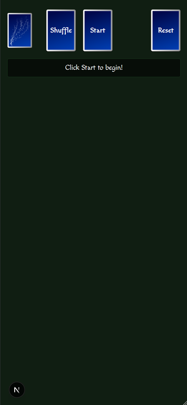
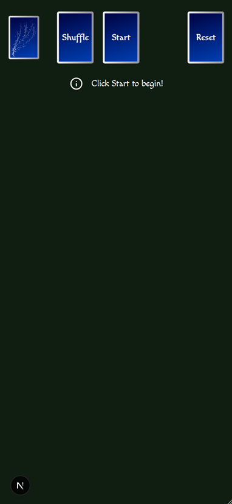

# Lesson: Usability - Wrong Affordance

This is was my first version of the initial screen:

I noticed that my friend clicked on the text "Click Start to begin!" I gave some thought to this and realized its because I made it look like a button. However, my intention was to make it standout so the user notices it first. I used an info icon next to the text and removed the button-like appearance after this observation:

